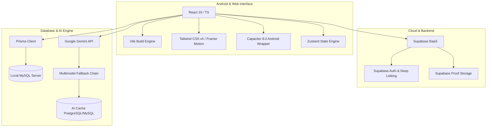

# 🏰 ARUTHA (Aruthtale Project) - Dokumen Memori & Rangkuman Teknis Komprehensif

---
project: Arutha
ecosystem: Aruthtale
type: RPG Self-Development & Psychology WebApp/Mobile
created_at: 2026-05-19
status: Optimized & Immersive (Final Stable)
tags:
  - project/arutha
  - tech/react19
  - tech/gemini-ai
  - tech/supabase
  - tech/capacitor8
  - tech/prisma-mysql
  - status/final-stabilized
---

## 1. PENGENALAN & VISI NARASI (INTRODUCTION & VISION)

**ARUTHA** (bagian dari ekosistem **Aruthtale**) adalah sebuah aplikasi *mobile-first* revolusioner yang mengubah konsep pengembangan diri (*self-development*) dan kesehatan mental menjadi sebuah petualangan RPG (*Role-Playing Game*) fantasi gelap yang imersif. 

Alih-alih memaksa pengguna mengisi daftar tugas (*to-do list*) yang membosankan dan kaku, Arutha memposisikan dirinya sebagai **Game Master** bertenaga AI yang memandu pengguna dalam petualangan hidup nyata. Melalui narasi misterius, visualisasi status bergaya RPG, dan interaksi dengan asisten spiritual serta psikologis bertenaga kecerdasan buatan, Arutha menjembatani sains psikologi modern dengan mekanik permainan fantasi yang adiktif dan mendalam.

---

## 2. ALUR PENGGUNA & MEKANIK UTAMA RPG (USER JOURNEY & RPG MECHANICS)

### 🪐 A. Wawancara Psikologis & Karakterisasi (Onboarding & Character Reveal)
1. **Psychological Onboarding**: Saat membuka aplikasi pertama kali, pengguna disambut oleh antarmuka sinematik dan misterius untuk menjalani fase *Onboarding Psikologis* (wawancara 10 pertanyaan santai yang disesuaikan secara dinamis dengan konteks usia, gender, dan zodiak).
2. **Character Reveal**: Algoritma AI menganalisis respon pengguna secara mendalam untuk menentukan tipe kepribadian standar **MBTI** (seperti *INFJ - The Advocate*, *INTJ - The Architect*, dll.), memberikan judul gelar karakter (*Personality Title*), deskripsi kepribadian secara naratif (*Chronicle of Identity*), dan mendistribusikan poin statistik awal pada **5 Dimensi Utama**.

### 📊 B. 5 Dimensi RPG (The 5 Core Dimensions)
Progres hidup pengguna dipetakan ke dalam 5 status RPG klasik yang merepresentasikan pilar keseimbangan hidup:
*   **JIWA (Spirit)**: Mengukur ketenangan mental, spiritualitas, regulasi emosi, kedamaian batin, dan tingkat introspeksi diri.
*   **RAGA (Vitality)**: Mengukur kekuatan fisik, kebugaran, pola makan, energi harian, dan kedisiplinan berolahraga.
*   **HARTA (Fortune)**: Mengukur stabilitas finansial, pengelolaan anggaran, ambisi karir, dan produktivitas profesional.
*   **ILMU (Wisdom)**: Mengukur kapasitas belajar, logika berpikir, penguasaan keterampilan baru, dan rasa ingin tahu akademik.
*   **KARMA (Empathy)**: Mengukur dampak sosial, hubungan antarpribadi, empati, kebaikan sukarela, dan kontribusi terhadap komunitas.

Visualisasi status ini ditampilkan secara elegan menggunakan **Radar Chart** dan diagram garis dinamis untuk melihat riwayat perubahan harian (*Stat History*).

### ⚔️ C. Sistem Misi Dinamis (Dynamic Quest System)
AI bertindak sebagai *Game Master* yang memformulasikan tantangan nyata bagi pengguna. Misi dihasilkan secara personal untuk menyerang kelemahan statistik terendah pengguna:
*   **Daily Quests (Rites)**: Misi harian ringan untuk menjaga momentum kedisiplinan (hadiah XP: 100 - 200). Misi disesuaikan dengan suasana hati harian (*Mood Integration*).
*   **Weekly Quests (Trials)**: Tantangan multi-fase progresif yang membutuhkan ketahanan beberapa hari (hadiah XP: 500 - 1000).
*   **Monthly Quests (Sagas)**: Pencapaian hidup berskala besar dalam satu bulan (hadiah XP: 2500 - 5000).
*   **Global Quests (Anomaly)**: Misi khusus yang diterbitkan oleh Admin di *Admin Sanctum* untuk diperebutkan oleh semua pahlawan (*first-come, first-served*).
*   **Recovery Quests**: Misi pemulihan mental yang sangat ringan, dipicu otomatis ketika sistem mendeteksi ketidakaktifan pengguna guna mencegah depresiasi status (*Decay & Recovery*).

### 🔍 D. Verifikasi Bukti Misi Stoik (AI Proof Verification)
Untuk mencegah kecurangan (*cheating*), penyelesaian misi diverifikasi oleh **AI Stoic Mentor**. 
*   Pengguna dapat mengunggah catatan refleksi tertulis beserta foto bukti fisik (opsional).
*   AI mengevaluasi kredibilitas bukti secara cerdas. Jika bukti terdeteksi asal-asalan (seperti teks acak "qwerty", "ok", "done"), AI Mentor Stoik akan **menolak progres** secara tegas namun tetap bijaksana, memberikan umpan balik filosofis agar pengguna mengulanginya dengan jujur.

### 🎭 E. Sistem Bakat (Talent System)
Setiap kali pahlawan mengisi penuh bilah XP, mereka akan **Level Up** dengan efek animasi imersif. Setiap kenaikan level tertentu (*milestone*), pengguna memperoleh poin bakat untuk membuka **Passive Bakat (Talent)** yang memberikan modifier XP atau penguat status pada dimensi tertentu secara permanen.

---

## 3. ARSITEKTUR KECERDASAN BUATAN & INTEGRASI GEMINI (AI ARCHITECTURE)

Integrasi kecerdasan buatan dalam Arutha dirancang agar responsif, hemat kuota, dan tangguh terhadap gangguan jaringan.

### 🚀 A. Rantai Cadangan Model (Multimodel Fallback Chain)
Sistem menggunakan SDK `@google/genai` dengan skema *fallback* bertingkat untuk menghindari pembatasan kuota (*429 Rate Limit*) dan gangguan server (*503 Service Unavailable*). Urutan model yang digunakan:
1.  `gemini-2.5-flash` (Model utama, cepat dan berkapasitas tinggi)
2.  `gemini-1.5-flash` (Fallback stabil)
3.  `gemini-3.1-flash-lite-preview` / `gemini-3.1-flash-lite` (Model hemat sumber daya)
4.  `gemini-3-flash-preview`
5.  `gemini-3.1-pro-preview` (Model cadangan berkapasitas penalaran tinggi)

### 💾 B. Supabase AI Caching
Untuk menekan biaya operasional API dan menjaga latensi tetap rendah, Arutha mengintegrasikan tabel `ai_cache`. Setiap instruksi AI yang tidak memerlukan data *real-time* (seperti Misi Harian yang di-*generate* sekali sehari, analisis onboarding, dsb.) akan disimpan di basis data selama **24 jam**. Hit API ke server Google hanya dilakukan jika cache kedaluwarsa atau tidak ditemukan.

### 👥 C. AI Companions (Mitra Virtual)
*   **The Arbiter**: Pendamping sistem yang ramah dan cerdas. Arbiter memahami data statistik, tingkat level, dan profil kepribadian pengguna untuk diajak berdiskusi santai mengenai performa hidup pengguna berdasarkan data numerik.
*   **Soul Guard**: Konselor psikologis personal yang hangat dan empatik. Soul Guard berinteraksi menggunakan teknik psikoterapi terstruktur yang dibagi dalam **3 Fase Percakapan**:
    *   *Fase 1 (Pesan 1-3)*: Membangun rasa aman, mendengarkan, dan memberikan validasi emosi yang hangat.
    *   *Fase 2 (Pesan 4-8)*: Eksplorasi emosi mendalam dengan mengajukan pertanyaan terbuka yang reflektif.
    *   *Fase 3 (Pesan 9+)*: Memberikan penguatan jiwa, afirmasi positif, dan dukungan tindakan pemulihan.
*   **Mental State Analysis**: Di balik layar, sistem menganalisis log percakapan dengan Soul Guard secara periodik untuk mendeteksi *Kondisi Dominan*, menentukan *Tingkat Risiko Mental* (`GREEN`, `YELLOW`, `RED`), memetakan pola utama, serta merumuskan rekomendasi penanganan spiritual/mental.

---

## 4. TUMPUKAN TEKNOLOGI & ARSITEKTUR (TECH STACK & ARCHITECTURE)

Arutha dibangun di atas arsitektur modern yang menyatukan performa tinggi web dengan portabilitas aplikasi mobile native.

### 💻 A. Spesifikasi Frontend & Desain
*   **Framework Core**: React 19 (TypeScript) untuk reaktivitas tingkat tinggi.
*   **Build Bundler**: Vite (sangat cepat dengan konfigurasi modular).
*   **Design System**: Tailwind CSS v4 dikombinasikan dengan sentuhan animasi dinamis **Framer Motion** untuk efek transisi antar halaman (500ms), modal level-up yang dramatis, serta *active scale feedback* bergaya haptic.
*   **Tema Estetika**: Tema gelap premium (*Dark RPG & Glassmorphism*) dengan paduan tekstur butiran halus (*Grainy SVG Noise Texture*) untuk kedalaman visual yang mewah, serta logo berpijar dinamis.
*   **Visualisasi Data**: **Recharts** untuk Radar Chart status pahlawan, yang dioptimalkan menggunakan teknik *delayed rendering* (debounce 500ms) untuk mencegah kesalahan pembacaan dimensi kontainer pada layar mobile (`width -1`).

### 📱 B. Integrasi Mobile Native (Capacitor 8.0)
*   **Native Wrapper**: Capacitor 8.0 membungkus frontend React menjadi aplikasi Android berperforma tinggi.
*   **Zero-Latency Local Mode**: Menggunakan kompilasi direktori lokal (`dist`) alih-alih URL *live hosting* untuk menjamin stabilitas 100% tanpa internet stabil.
*   **Optimasi Startup**: Mengubah latar belakang native Android dari warna putih standar ke hitam pekat (`#000000`) untuk menghilangkan kilatan putih saat startup (*white flash freeze*).
*   **Keamanan Area**: Kompatibilitas penuh terhadap *Safe Area* untuk menangani notch kamera dan tombol navigasi sistem di Android.

### 🔐 C. Autentikasi & Keamanan (Supabase & Deep Linking)
*   **Deep Link Integration**: Redirect Google OAuth/Email Login dari browser kembali secara otomatis ke dalam aplikasi native Android menggunakan URL Scheme kustom `com.aruthtale.arutha`.
*   **Session Refresh Security**: Memaksa refresh sesi token sebelum operasi data sensitif dilakukan guna menghindari error `AuthSessionMissing`.

---

## 5. SKEMA BASIS DATA RELASIONAL (DATABASE SCHEMA)

Aplikasi ini menggunakan **Prisma ORM** dengan basis data relasional **MySQL** (dan sinkronisasi tabel Supabase). Berikut adalah rincian tabel utama berdasarkan `schema.prisma`:

### 👤 1. `arutha_user` (Tabel Inti Pengguna)
Menyimpan profil pahlawan, status level, XP, akumulasi streak, konfigurasi bakat, serta cache quest aktif.
*   `id` (String, PK, UUID)
*   `supabase_id` (String, Unique, Link ke Auth Supabase)
*   `email` & `username` (String, Unique)
*   `usia` (Int) & `gender` (String) & `birth_date` (DateTime) & `zodiac` (String)
*   `level` (Int, default 1) & `xp` (Int, default 0)
*   `active_quests` (Json, Cache quest harian aktif)
*   `available_weekly_quests` & `active_weekly_quests` (Json)
*   `streak` (Int) & `last_streak_date` (DateTime)
*   `talents` (Json, Bakat yang telah diaktifkan)
*   `talent_choices_available` (Int, Sisa poin bakat)
*   `name_change_count` (Int, batas maksimal 3x ganti nama)
*   `last_name_change` (DateTime, Cooldown ganti nama 3 hari)
*   `fatigue_days` (Int, Hari absen terdeteksi)

### 🎭 2. `character_profile` (Profil Kepribadian AI)
Menyimpan rangkuman analisis psikologis dari wawancara onboarding.
*   `id` (String, PK)
*   `user_id` (String, FK ke `arutha_user`)
*   `personality_type` (String, format MBTI)
*   `personality_title` (String, Judul pahlawan)
*   `personality_desc` (String, Deskripsi naratif)
*   `character_summary` (String, Esensi jiwa)
*   `jiwa` & `raga` & `harta` & `ilmu` & `karma` (Int, Statistik dasar max 50)
*   `rationale` (String, Alasan ilmiah dari keputusan AI)

### 📈 3. `stat_history` (Log Riwayat Pertumbuhan)
Merekam perubahan statistik pengguna dari hari ke hari untuk divisualisasikan dalam bagan garis.
*   `id` (String, PK)
*   `user_id` (String, FK ke `arutha_user`)
*   `jiwa` & `raga` & `harta` & `ilmu` & `karma` (Int)
*   `created_at` (DateTime)

### 📝 4. `arutha_quest_log` (Buku Harian Misi Personal)
Mencatat seluruh riwayat misi yang diterima, diselesaikan, atau gagal beserta tanggapan AI Stoik.
*   `id` (String, PK)
*   `user_id` (String, FK ke `arutha_user`)
*   `quest_id` (String)
*   `quest_type` (Enum: `DAILY`, `WEEKLY`, `RECOVERY`, `GLOBAL`, `WORLD`)
*   `title` (String)
*   `stat_type` (String, Dimensi stat target)
*   `xp_reward` (Int)
*   `proof_note` & `proof_photo_url` (String, Bukti penyelesaian)
*   `ai_feedback` (String, Komentar Stoik Mentor)
*   `status` (Enum: `IN_PROGRESS`, `COMPLETED`, `FAILED`)

### 💬 5. `chat_logs` (Rekam Obrolan AI)
Menyimpan log histori obrolan untuk menjaga memori kontekstual asisten virtual.
*   `id` (String, PK)
*   `user_id` (String)
*   `role` (Enum: `user`, `assistant`)
*   `content` (String, Teks pesan)
*   `category` (String, "arbiter" atau "soulguard")

### 🌐 6. `arutha_global_quests` & `submissions` (Misi Dunia)
Mekanisme Misi Dunia yang dibuat oleh Admin untuk diperebutkan oleh pemain.
*   `arutha_global_quests`: `id`, `title`, `description`, `stat_type`, `reward_xp`, `expires_at`, `is_claimed`, `claimed_by`
*   `arutha_global_quest_submissions`: `id`, `quest_id` (FK), `user_id` (FK), `proof_photo`, `proof_note`, `status` (`PENDING`, `APPROVED`, `REJECTED`)

---

## 6. FITUR ADMINISTRATOR & CONTROL CENTER (ADMIN SANCTUM)

Pusat kendali khusus yang dirancang eksklusif untuk email administrator (`aruthtale@gmail.com`) guna memantau ekosistem secara penuh:
1.  **User Management Dashboard**: Menampilkan daftar seluruh pahlawan yang terdaftar lengkap dengan demografi usia, gender, level, dan tipe MBTI.
2.  **AI Profile Inspection**: Memungkinkan admin menginspeksi secara mendalam narasi kepribadian serta statistik orisinil setiap pengguna hasil wawancara AI.
3.  **Developer Fast-Testing Tools**:
    *   **+LVL Button**: Tombol instan untuk menaikkan level user secara langsung untuk keperluan pengujian.
    *   **+500 XP Button**: Memberikan bonus XP instan ke pengguna tertentu.
    *   **Reset Cooldown Button**: Mereset masa tunggu perubahan nama pengguna secara instan.
4.  **Global Quest Creator**: Formulir admin untuk membuat, mempublikasikan, atau memoderasi Global Quests (*Anomaly*) beserta validasi persetujuan buktinya secara langsung.
5.  **Safe Cascade Delete Security**: Implementasi penghapusan data berjenjang yang aman di mana saat akun user dihapus oleh admin, semua relasi data (*Stat History*, *Character Profile*, *Quest Log*) akan terhapus bersih tanpa menyebabkan kerusakan integritas basis data.

---

## 7. CATATAN OPTIMASI KRITIS & BUG FIXES TERAKHIR

Aplikasi telah melewati berbagai fase stabilisasi penting:
*   **Name Change Quota Policy**: Menambahkan batas kuota perubahan nama sebanyak **3 kali** dengan cooldown **3 hari** jika kuota habis, lengkap dengan badge indikator dinamis berbasis Framer Motion.
*   **Radar Chart width(-1) Fix**: Mengatasi galat rendering chart pada mobile dengan memicu rendering terjeda (*delayed rendering*) menggunakan timer 500ms saat kontainer layout sudah stabil.
*   **Supabase Bad Request 400 (Stat History)**: Menyelesaikan masalah kegagalan pencatatan sejarah harian dengan membulatkan nilai stat menjadi integer murni (`Math.round`) dan menghasilkan UUID manual menggunakan `crypto.randomUUID()` untuk menjamin keunikan baris.
*   **Hero Duplicate Prevention**: Menambahkan pertahanan *Anti-Duplication* di mana sistem memeriksa keberadaan `user_id` sebelum menyimpan profil onboarding baru, melakukan `UPDATE` data alih-alih `INSERT` duplikat jika pengguna yang sama melakukan re-onboarding.
*   **Deep Link OAuth Resiliency**: Menyediakan skema login mulus dari penjelajah web eksternal kembali ke Capacitor Android Shell tanpa kehilangan token sesi auth.

---
*Dokumen ini merupakan replika digital lengkap dari blueprint proyek **ARUTHA**, siap diintegrasikan sebagai Memori Pengetahuan utama di dalam Obsidian Vault Anda.*
